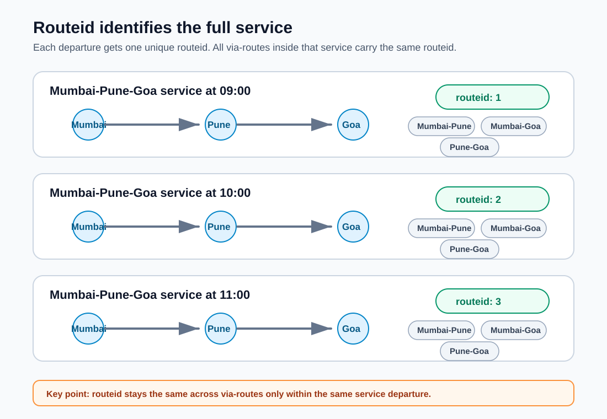
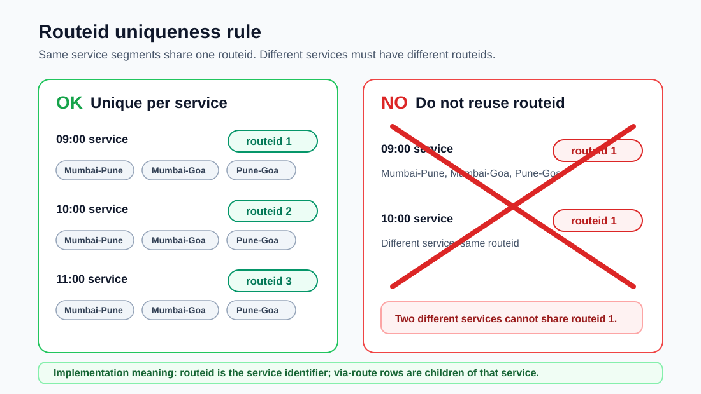

# Routeid service identifier visuals

These simple visuals explain that `routeid` identifies the complete service that
Bo is running, not an individual via-route segment.

## Rules

- One service has one `routeid`.
- All via-routes for the same service use that same `routeid`.
- Different services must not reuse a `routeid`.

## Example services

| Service | Routeid | Via-routes carrying the same routeid |
| --- | ---: | --- |
| Mumbai-Pune-Goa 09:00 | 1 | Mumbai-Pune, Mumbai-Goa, Pune-Goa |
| Mumbai-Pune-Goa 10:00 | 2 | Mumbai-Pune, Mumbai-Goa, Pune-Goa |
| Mumbai-Pune-Goa 11:00 | 3 | Mumbai-Pune, Mumbai-Goa, Pune-Goa |

## Visual 1: routeid groups by service

## Visual 2: uniqueness rule

Editable SVG source files are kept next to the PNGs in `docs/assets/`.
